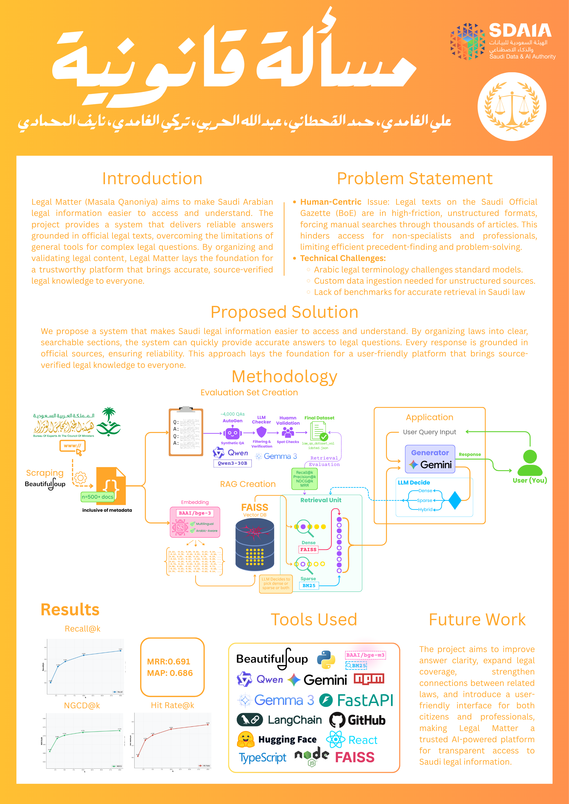
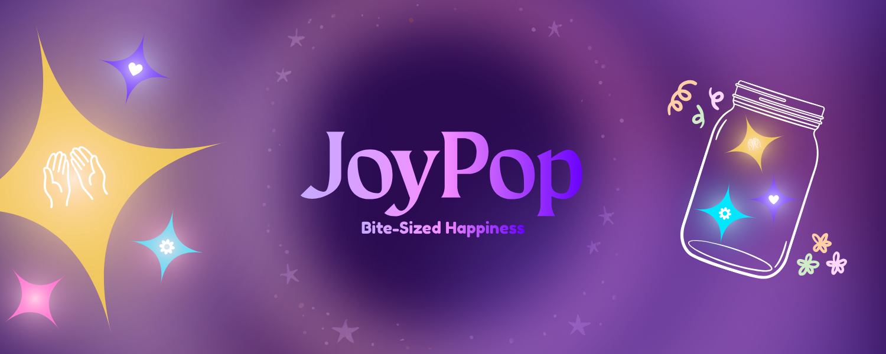
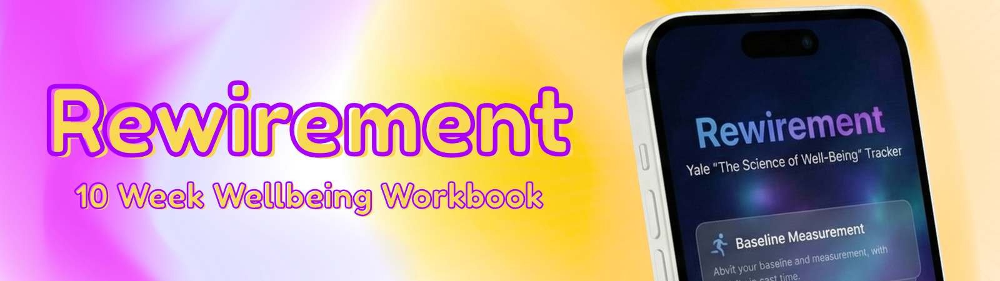

  

 

<h1 align="center">Ali Alghamdi</h1>

  Computer Science student · Building software for real classrooms and real problems

 

---

## Affinity English

> *A classroom tool built for the Saudi English classroom. Designed with intention. Built with care.*

Affinity English is a **teacher-facing classroom presentation tool** built specifically for Saudi Arabian English classrooms following the Mega Goal curriculum. The teacher opens it, projects it on the whiteboard, and the class sees it. It covers the full **Mega Goal 1** curriculum across 12 units.

At its core is a proprietary system called the **Serotonin Engine** — 9 accent colors, each with a curated set of harmonious secondaries, cycling continuously across every screen. Grammar structures are **badged**, key terms are **colorized**, and important phrases are **highlighted** — all adapting live to whichever color is active. The font is Fredoka. Nothing about it looks like a school tool.

  

**What it includes:**

- **Grammar Explainer** — Card-by-card lessons for all 12 units, with badged structures, colorized rules, Arabic translations, and a typing caret animation on examples
- **Vocabulary** — Flipcard player for every word set in the book, with Arabic meanings, definitions, examples, synonyms, and teacher-controlled reveal pacing
- **Revise** — A fully configurable MCQ session with 100 questions per unit. With a class selected, it becomes a **Star Challenge** — students' names appear on screen, and a star animates from the correct answer to their name when they get it right
- **Lesson Lab** — Gemini-powered lesson generator. Describe what you want to teach, pick a type (Grammar / Vocab / Questions / Mixed), and a complete lesson is produced in under 40 seconds — with full Serotonin Engine rendering applied automatically
- **Canvas** — A classroom whiteboard with the app's full typographic system, 8 color-coded callout types, saved boards, and AI-generated layouts
- **Idle Screens** — Four animated full-screen displays: Grammar Idle (658 sentences), Vocabulary Carousel, Idioms (200), and Spot the Error
- **Breathing** — Three scientific breathing exercises for classroom stress, on a deep black background
- **Students & Stars** — Class rosters with 567 distinct student profiles (9 colors × 63 symbols), four star tiers, and print-ready personalized certificate reports

  

**Built with:** React · Gemini · Supabase

---

## مسألة قانونية — Legal Matter

  

An intelligent AI-powered legal assistant specialized in **Saudi Arabian law**, featuring a hybrid RAG system and a modern Arabic-first interface. I was a contributing member of this project.

The system combines **FAISS (dense)** and **BM25 (sparse)** retrieval over 16,371 hierarchical Saudi law documents, with **Gemini 2.5 Flash** as the tool-calling LLM. The frontend is built in React + TypeScript with full RTL support and the مسألة قانونية brand identity.

**Key highlights:**
- Hybrid retrieval (semantic + keyword) for accurate legal document lookup
- Smart prompting that skips unnecessary retrieval for greetings and general queries
- Multi-turn conversation with persistent session history
- Real-time WebSocket connection with live typing indicators
- Custom Arabic branding with an orange `#FFA629` theme

**Stack:** FastAPI · React · TypeScript · FAISS · BGE-M3 · Gemini 2.5 Flash · shadcn/ui

---

## JoyPop

  

JoyPop is a wellbeing app that turns the science of happiness into daily micro-actions — inspired by Yale's Science of Wellbeing course.

Three evidence-based practices — **savouring moments**, **acts of kindness**, and **expressing gratitude** — each earn a uniquely designed star. 60 stars fill a collectible jar, designed for roughly one month of mindful living. Completed jars are shelved; you start fresh with a new one. Hashtag analytics and streak tracking help you see patterns in what you savour, who you connect with, and what you're grateful for.

**Built with:** Next.js · Supabase · Vercel · TypeScript

---

## Rewirement

  

A self-contained, offline-first digital workbook for Yale's Science of Well-Being course. Glassmorphic React UI, multiple themes, and full local progress tracking — delivered as a single HTML file with no server required.

---

  <em>Let's build something worth looking at.</em>

